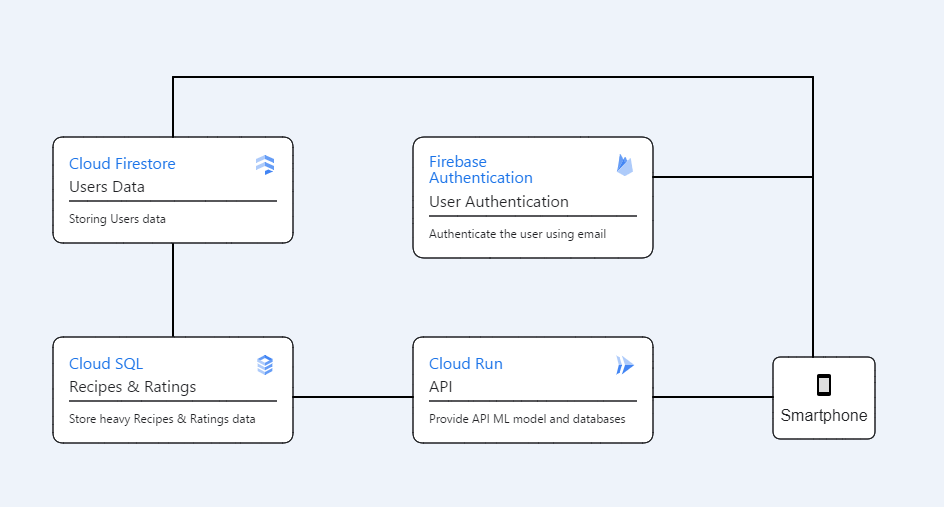
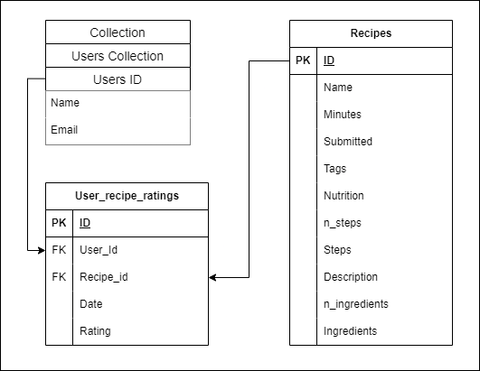

# Cloud Computing Structure


## Google Cloud Platform Architecture



## Database Design



## API Documentation

### Input Rating

Endpoint : POST /api/rating

Request Body :

```json
{
    "user_id" : "lsAY7xHrm2UgqIyM7e0yyyL58hn2",
    "recipe_id" : 448053,
    "rating" : 5
}
```

Response Body Success :

```json
{
    "message":"Rating added/updated successfully"
}
```

Response Body Error :

```json
{
  "errors": "Failed to fetch data from the databases. Error details: ....}"
}
```

### Recomendation Prediction

Endpoint : POST /api/predict

Request Body :

```json
{
    "ingres" : ["flour"],
    "user_id" : "lsAY7xHrm2UgqIyM7e0yyyL58hn2"
}
```

Response Body Success :

```json
[
    {
        "id": 126123,
        "name": "corn syrup   simple syrup"
    },
    {
        "id": "....",
        "name": "..."
    }
]
```

Response Body Error :

```json
{
  "errors": "Failed to fetch data from the databases. Error details: ....}"
}
```

### 10 Random Recipes

Endpoint : GET /api/recipes

Response Body Success :

```json
[
    {
        "id": 126123,
        "name": "corn syrup   simple syrup"
    },
    {
        "id": "....",
        "name": "..."
    }
]
```

Response Body Error :

```json
{
  "errors": "Failed to fetch data from the databases. Error details: ....}"
}
```

### Search Recipes

Endpoint : GET /api/search/...

Response Body Success :

```json
[
    {
        "id": 126123,
        "name": "corn syrup   simple syrup"
    },
    {
        "id": "....",
        "name": "..."
    }
]
```

Response Body Error :

```json
{
  "errors": "Failed to fetch data from the databases. Error details: ....}"
}
```

### Get Recipe and the Ratings

Endpoint : GET /api/recipe/rating/(recipe_id)

Response Body Success :

```json
{
    "average_rating": 3.67,
    "result_recipe": {
        "id": 34614,
        "ingredients": "['sugar', 'water', 'salt', 'vanilla extract']",
        "minutes": 25,
        "n_ingridients": 4,
        "n_steps": 7,
        "name": "easy caramel sorbet",
        "steps": "['in dry heavy saucepan , cook sugar , alone , undisturbed', 'over moderate heat until it begins to melt', 'continue cooking , stirring with a fork , until it is melted completely& a deep caramel', 'remove from heat& carefully add water down side of pan', 'return to heat& cook caramel , stirring , until dissolved completely', 'stir in salt& vanilla extract& chill until cold', 'freeze sorbet in an ice-cream maker']"
    }
}
```

Response Body Error :

```json
{
  "errors": "Failed to fetch data from the databases. Error details: ....}"
}
```